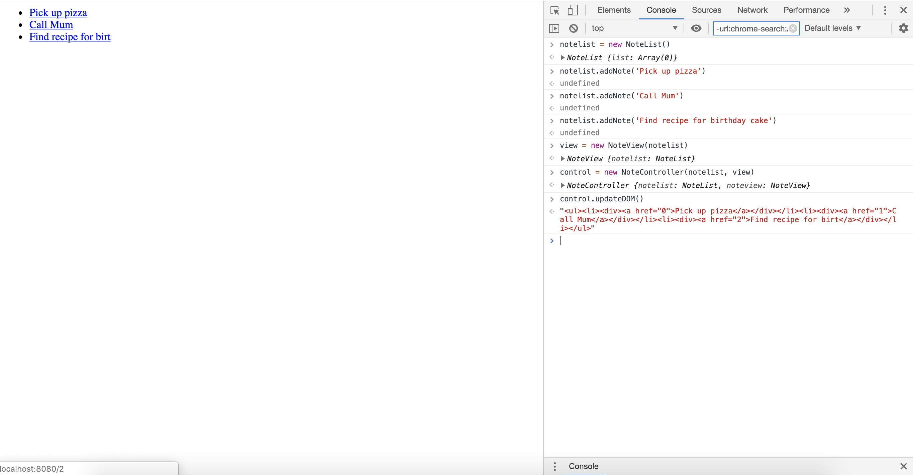

# Notes App

A Week 7 Makers Academy project to write a frontend, single page app using only pure JavaScript.

## User Stories

```
As a programmer
I can see a list of my notes, where each note is abbreviated to the first 20 characters
So I can find the one I want

As a programmer
I can create a new note
So I can record something I need to remember

As a programmer
I can see the full text of an individual note on its own page
So I can see all the information in the note
```

## Using this program
* Clone this repo
* Install Node (a program for running JavaScript on the command line, rather than in a web browser) by running `npm install` from the command line
* Install `http-server` from npm (a Node-based package manager) by running `npm install http-server` from the command line
* Enter `node node_modules/http-server/bin/http-server`from the command line
* Visit http://localhost:8080/ (please note, you may need to clear your browser cache first!)
* Navigate to the console in Chrome Dev Tools
* Type in `list = new NoteList()` to begin a new list of notes
* To add a note, type in `list.addNote('note')` (replacing 'note' for your note)
* Create a new view by typing `view = new NoteView(list)`
* Create a new controller by typing `control = new NoteController(list, view)`
* Update the page by typing in `control.updateDOM()`

Here is a screenshot of the program in action:

<div align="center">
    
</div>

You can see that the notes are displayed as links, each with their own ID which will navigate to a new page when clicked (e.g. http://localhost:8080/1) I have yet to implement the feature whereby you will be able to see the full note when you click on that link.

Only the first 20 characters of each note will be displayed on the list, to make it neater :)

## Build Status

Mostly complete, just need to implement the final user story. Tests all passing and have successfully mocked in my tests.

## Learning Objectives
* Write unit tests without using a testing library
* write a frontend, single page app using only pure JavaScript

## To Fix
* Implement final user story.

## Acknowledgments

Jordan Roberts - Makers Academy Challenge
